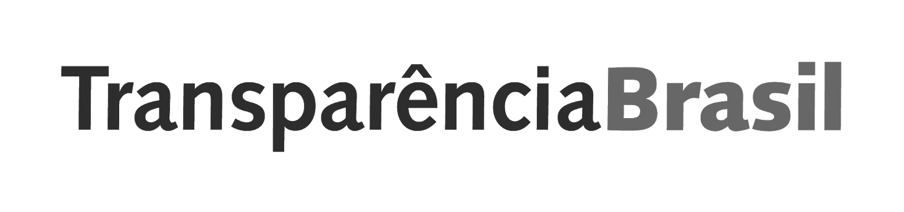

# Sobre

Desenvolvido em parceria entre organizações da sociedade civil e a Frente Parlamentar pelos Objetivos de Desenvolvimento Sustentável (ODS) da Assembléia Legislativa do Estado de São Paulo - Alesp, este guia tem o objetivo de apoiar e informar todas as pessoas interessadas em fortalecer a transparência das ações governamentais, a responsabilização dos agentes públicos e o bom uso dos recursos públicos.

## PARTICIPANTES

Presidida pela Deputada Estadual Marina Helou da Rede Sustentabilidade, a Frente Parlamentar pelos Objetivos de Desenvolvimento Sustentável (ODS) tem por objetivo agregar especialistas, representantes do poder público, prefeitos, vereadores, empresários, organizações sociais e sociedade civil na proposição de novos projetos, práticas, estratégias, ações e caminhos para políticas públicas que abordem de forma efetiva as metas propostas na Agenda 2030, desenvolvida por líderes globais na ONU em 2015.

O Instituto de Governo Aberto é uma organização fundada por mulheres que atua para o fortalecimento da gestão pública e da população por meio da transparência, da participação social e da integridade. Tem como missão contribuir com uma sociedade justa, inclusiva e igualitária e acredita que o caminho para isso é uma relação mais responsável e de confiança entre os cidadãos e o poder público.

A Open Knowledge Brasil - OKBR, também conhecida como Rede pelo Conhecimento Livre, é uma organização da sociedade civil sem fins lucrativos e apartidária que atua no país desde 2013. Desenvolve e incentiva o uso de tecnologias cívicas e de dados abertos, realiza análises de políticas públicas e promove o conhecimento livre para tornar a relação entre governo e sociedade mais transparente e participativa.

A Transparência Brasil é uma organização sem fins lucrativos fundada há mais de 20 anos, cuja missão é promover a transparência e o controle social do poder público, contribuindo para a integridade e o aperfeiçoamento das instituições, das políticas públicas e do processo democrático.

Clique nas imagens e para conhecer o trabalho de cada uma.

[{: style="height:80px"}](https://www.al.sp.gov.br/alesp/frentes-parlamentares-detalhe/?idFrente=1710)
[{: style="height:50px"}](http://www.ok.org.br)
[{: style="height:50px"}](http://www.transparencia.org.br)
[{: style="height:70px"}](https://web.facebook.com/institutodegovernoaberto/)

## OBJETIVOS DE DESENVOLVIMENTO SUSTENTÁVEL - ODS

Os Objetivos de Desenvolvimento Sustentável - ODS são uma coleção de 17 metas para direcionar o esforço global de políticas públicas para o desenvolvimento social, humano e ambiental até 2030. 

O Brasil participou de todas as sessões da negociação intergovernamental, onde se chegou ao acordo que contempla os 17 Objetivos desdobrados em 169 metas.

O presente trabalho está profundamente alinhado ao objetivo 16 “Promover sociedades pacíficas e inclusivas para o desenvolvimento sustentável, proporcionar o acesso à justiça para todos e construir instituições eficazes, responsáveis e inclusivas em todos os níveis”, e às seguintes metas:

**16.5** Reduzir substancialmente a corrupção e o suborno em todas as suas formas

**16.6** Desenvolver instituições eficazes, responsáveis e transparentes em todos os níveis

**16.7** Garantir a tomada de decisão responsiva, inclusiva, participativa e representativa em todos os níveis

**16.10** Assegurar o acesso público à informação e proteger as liberdades fundamentais, em conformidade com a legislação nacional e os acordos internacionais
